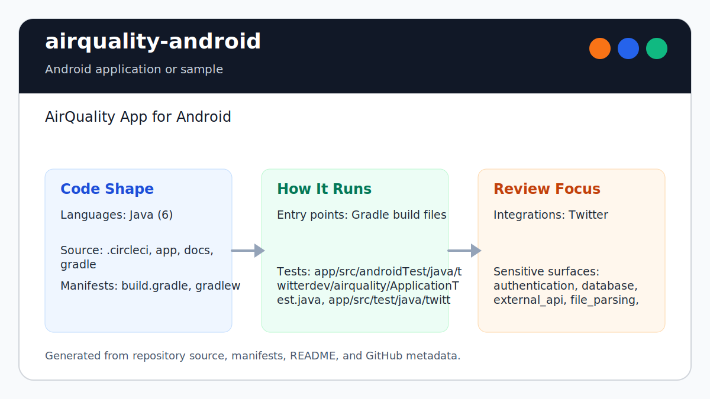

# airquality-android

<!-- README-OVERVIEW-IMAGE -->


## Overview

`garethpaul/airquality-android` is an Android application or sample. AirQuality App for Android

This README is based on the checked-in source, manifests, scripts, and repository metadata on the `master` branch. The project language mix found during review was: Java (6).

## Repository Contents

- `README.md` - project overview and local usage notes
- `build.gradle` - Android or Gradle build configuration
- `.circleci` - source or example code
- `app` - source or example code
- `docs` - source or example code
- `gradle` - source or example code
- `gradlew` - Android or Gradle build configuration
- `SECURITY.md` - security reporting and disclosure guidance
- `VISION.md` - project direction and maintenance guardrails

Additional scan context:

- Source directories: .circleci, app, docs, gradle
- Dependency and build manifests: build.gradle, gradlew
- Entry points or build surfaces: Gradle build files
- Test-looking files: app/src/androidTest/java/twitterdev/airquality/ApplicationTest.java, app/src/test/java/twitterdev/airquality/NetworkRequestTest.java

## Getting Started

### Prerequisites

- Git
- Android Studio or a compatible Android SDK
- Gradle or the checked-in Gradle wrapper when present

### Setup

The generated wrapper still executes Gradle 2.2.1 for compatibility. It uses
`distributionSha256Sum` to authenticate the downloaded distribution, while the
SDK-free contracts verify the checked-in wrapper JAR and launchers. This does
not make an uncached build offline-reproducible; the first build still needs
Gradle's HTTPS distribution service.

```bash
git clone https://github.com/garethpaul/airquality-android.git
cd airquality-android
```

The setup commands above are derived from repository files. Legacy mobile, Python, or JavaScript samples may require older SDKs or package versions than a modern workstation uses by default.

## Running or Using the Project

- Use Android Studio to open the project or run `./gradlew assembleDebug` when the Android SDK is configured.

## Testing and Verification

- `make check` - run SDK-free static contracts and skip Gradle when no Android SDK is configured
- `./gradlew test` or Android Studio's test runner when the SDK is configured
- GitHub Actions preserves the SDK-free `make check` baseline on Python 3.10,
  3.12, and 3.14 and runs a separate Java 8/API 22 Android gate on fixed Ubuntu
  24.04 runners. Superseded branch runs are cancelled.

When the required SDK or runtime is unavailable, use static checks and source review first, then verify on a machine that has the matching platform toolchain.

Use [`DEVICE_VERIFICATION.md`](DEVICE_VERIFICATION.md) for the emulator or
physical-device matrix. It requires exact-commit toolchain evidence for launch,
permissions, location, lifecycle, backend failures, and log redaction, and it
keeps unexecuted scenarios explicit rather than treating static checks as
device proof.

## Configuration and Secrets

- Detected references to Twitter. Keep API keys, OAuth credentials, tokens, and account-specific values in local configuration only.
- `AirQualityApplication` skips Fabric/Twitter initialization while checked-in
  credential placeholders are blank.
- `NetworkRequest.buildUrl` trims and validates latitude and longitude, then
  sends canonical decimal coordinate values through URL encoding so Java-only
  numeric syntax cannot cross the backend boundary.
- `NetworkRequest.buildUrlFromParams` validates the `AsyncTask` parameter array before the background request path creates an HTTP request.
- `NetworkRequest` applies bounded connection and socket timeouts to the HTTP client used for the backend request.
- `NetworkRequest` rejects automatic redirects so the fixed HTTPS backend is
  the only transport target.
- `NetworkRequest` requires JSON response media types, accepting parameterized
  `application/json` and structured `application/*+json` values while rejecting
  missing, ambiguous, malformed, or non-JSON types before body access.
- Backend responses must contain exactly one Content-Type header before body access.
- Response Content-Type parsing accepts only space and tab as optional HTTP whitespace; CR, LF, and other controls fail before body access.
- Response charset metadata must be absent or unambiguous UTF-8 so declared
  metadata agrees with the strict decoder used before JSON parsing.
- Quoted Content-Type parameter values may contain commas; unquoted or combined
  comma values remain invalid.
- `NetworkRequest` accepts only 2xx responses and rejects malformed UTF-8 after
  validating strict Content-Length syntax and reading at most 1 MiB; it closes
  response and connection resources before JSON handling.
- Generic NetworkRequest failure logs preserve protocol, JSON, and parameter
  categories without recording throwable stack traces, coordinate-bearing
  request URLs, or provider exception details.
- `MainActivity` treats missing or malformed `air_quality` JSON as an explicit unknown state before accelerometer rendering.
- MainActivity accepts air_quality only when its JSON value is a nonblank string.
- MainActivity trims surrounding whitespace from nonblank air_quality strings.
- Android JVM tests use pinned `org.json:json:20260522` semantics instead of
  Android SDK not-mocked stubs; production continues using platform JSON.
- `MainActivity` owns its active air-quality request, ignores stale callbacks,
  and cancels the task when the activity is destroyed.
- Failed air-quality requests retain one resume-time retry from the accepted
  location; pause preserves that intent and successful responses clear it.
- `MainActivity` waits for a non-null location before starting the backend
  request and stops location updates after success, on pause, and on teardown.
- `MainActivity` checks that the location service is available before reading
  GPS or network provider state.
- Generic location acquisition failure logs preserve the stable failure
  category without recording provider, permission, or throwable details.
- `MainActivity` registers accelerometer updates only after confirming the sensor
  manager and accelerometer are available.
- `MainActivity` ignores malformed sensor events and missing display views
  before accelerometer-driven rendering.
- `LoginActivity` forwards Twitter activity results only when a login button
  was initialized for an unauthenticated session.
- `LoginActivity` sets Twitter login callbacks only after confirming the login
  button exists in the active layout.
- Local IDE metadata stays ignored so Android Studio, IntelliJ, and VS Code
  workspace files do not become part of the shared AirQuality baseline.

## Security and Privacy Notes

LoginActivity is the only exported launcher; MainActivity is explicitly non-exported and reached with an explicit in-app intent.

- Review changes touching authentication or token handling; examples from the scan include app/src/main/java/twitterdev/airquality/LoginActivity.java, docs/plans/2026-06-08-android-build-reproducibility.md.
- Review changes touching external API calls or credential-adjacent configuration; examples from the scan include app/build.gradle, app/src/main/AndroidManifest.xml, app/src/main/java/twitterdev/airquality/AirQualityApplication.java, app/src/main/java/twitterdev/airquality/LoginActivity.java, and 4 more.
- Review changes touching network requests, sockets, or service endpoints; examples from the scan include .circleci/config.yml, app/build.gradle, app/src/androidTest/java/twitterdev/airquality/ApplicationTest.java, app/src/main/AndroidManifest.xml, and 6 more.
- Review changes touching mobile permissions or privacy-sensitive device data; examples from the scan include CHANGES.md, app/src/main/AndroidManifest.xml, app/src/main/java/twitterdev/airquality/MainActivity.java, docs/plans/2026-06-08-android-build-reproducibility.md, and 1 more.
- Review changes touching file, media, JSON, XML, CSV, OCR, or data parsing; examples from the scan include .circleci/config.yml, CHANGES.md, app/lint.xml, app/src/main/AndroidManifest.xml, and 6 more.
- Review changes touching database, model, or persistence code; examples from the scan include docs/plans/2026-06-08-android-build-reproducibility.md.
- Review changes touching infrastructure, proxy, cloud, or deployment configuration; examples from the scan include .circleci/config.yml.

## Maintenance Notes

- This looks like a legacy Android project or sample. Expect Android SDK, Gradle, and support-library versions to matter.
- See `SECURITY.md` for vulnerability reporting and safe research guidance.
- See `VISION.md` for project direction and contribution guardrails.
- See `docs/plans/2026-06-09-network-request-async-parameter-contracts.md` for the background request parameter-validation pass.
- See `docs/plans/2026-06-09-network-request-timeout-contracts.md` for the HTTP timeout wiring pass.
- See `docs/plans/2026-06-09-main-activity-air-quality-state-contracts.md` for the activity fallback-state pass.
- See `docs/plans/2026-06-09-main-activity-location-manager-guard.md` for the
  location service availability guard.
- See `docs/plans/2026-06-09-main-activity-sensor-lifecycle-guard.md` for the
  accelerometer listener lifecycle guard.
- See `docs/plans/2026-06-09-main-activity-sensor-event-guard.md` for malformed
  sensor event and missing display-view guards.
- See `docs/plans/2026-06-09-login-activity-result-guard.md` for the Twitter
  login button lifecycle guard.
- See `docs/plans/2026-06-09-login-button-lookup-guard.md` for guarded Twitter
  login button callback setup.
- See `docs/plans/2026-06-09-application-credential-initialization-guard.md`
  for the blank credential startup guard.
- See `docs/plans/2026-06-09-editor-metadata-ignore.md` for the local editor
  metadata ignore baseline.
- See `docs/plans/2026-06-09-android-backup-opt-out.md` for the app-data
  backup opt-out baseline.
- See `docs/plans/2026-06-10-ci-baseline.md` for the hosted GitHub Actions
  baseline.
- See `docs/plans/2026-06-10-network-response-size-limit.md` for bounded backend
  response handling and root-independent verification.
- See `docs/plans/2026-06-12-main-activity-request-lifecycle.md` for request
  cancellation and stale-callback handling.
- See `docs/plans/2026-06-13-network-request-log-redaction.md` for generic
  NetworkRequest failure logs and location-detail redaction.
- See `docs/plans/2026-06-13-location-gated-air-quality-request.md` for the
  location-gated request and listener cleanup contract.
- See `docs/plans/2026-06-13-paused-air-quality-request-invalidation.md` for
  background request invalidation and interrupted-request resume behavior.
- See `docs/plans/2026-06-13-failed-air-quality-request-resume-retry.md` for
  failed-request retry preservation across pause and resume.
- See `docs/plans/2026-06-14-device-verification-checklist.md` for the
  device-evidence matrix and its explicit unexecuted boundary.

## Contributing

Keep changes small and tied to the project that is already present in this repository. For code changes, document the toolchain used, avoid committing generated dependency directories or local configuration, and update this README when setup or verification steps change.
